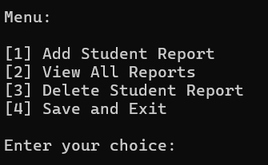

# **Student Grading System**

## Author
- **Name:** Kinshuk Pandala
- **Reg No:** 23BAC10026
- [LinkedIn](https://www.linkedin.com/in/kinshukpandala)
- [GitHub](https://github.com/Kinshukpandala)


## Repository

This project is also available in the following GitHub repository:

[Student Grading System Repository](https://github.com/Kinshukpandala/java-student-grading-system)

## Table of Contents
- [Introduction](#introduction)
- [Features](#features)
- [Concepts Used](#concepts-used)
- [Technologies Used](#technologies-used)
- [Setup and Execution](#setup-and-execution)
- [Usage Instructions](#usage-instructions)
- [Project Structure](#project-structure)
- [File Details](#file-details)
- [Acknowledgment](#acknowledgment)

## Introduction

The **Student Grading System** is a Java-based application designed to help manage student records, grades, and GPA calculations. This mini-project demonstrates object-oriented programming and file handling concepts in Java.


## **Features**
- Add student reports with grades for up to 7 subjects.
- View all stored reports in a tabular format.
- Delete a student report using their unique ID.
- Save and load reports using file serialization (`GradeReports.ser`).


## **Concepts Used**
This project demonstrates the following programming concepts:
1. **Object-Oriented Programming (OOP)**:
   - **Classes and Objects**: `Student`, `GradeReport`, and `FileHandler` represent core entities.
   - **Encapsulation**: Private fields and public getter methods.
   - **Inheritance & Polymorphism**: Usage of methods for modular functionality.
2. **File Handling**:
   - Serialization and deserialization to save and load data (`ObjectInputStream` and `ObjectOutputStream`).
3. **Data Structures**:
   - **`ArrayList`**: Used to store multiple grade reports.
   - **`HashMap`**: Maps subject names to their respective grades.
4. **Control Structures**:
   - Loops (`while`, `for`) for iterative operations.
   - Conditional statements (`if`, `switch`) for user input handling.
5. **Error Handling**:
   - Exception handling for file operations and invalid user inputs.
6. **Java Standard Library**:
   - **Scanner**: For input handling.
   - **String Manipulation**: Formatting and validating user input.


## **Technologies Used**
- **Programming Language**: Java
- **Data Storage**: Serialization (Java ObjectOutputStream)


## **Setup and Execution**
1. **Extract the ZIP file** provided by your faculty to a desired location.
2. Open the folder and navigate to the `src/` directory.
3. Compile the source files by running:

   ```bash
   javac -d bin src/*.java
   ```
4. Execute the program from the `bin/` directory using:

   ```bash
   java -cp bin StudentGradingSystem
   ```


## **Usage Instructions**
1. **Run the Program**: Start the system by following the execution steps above.
2. **Main Menu**:

   
   
   - `[1] Add Student Report`: Enter student name, ID, and subject grades.
   - `[2] View All Reports`: Display all stored student reports.
   - `[3] Delete Student Report`: Remove a report using the student's ID.
   - `[4] Save and Exit`: Save data to `GradeReports.ser` and exit the program.

3. **Grades to GPA Mapping**:
   - **S = 10**, **A = 9**, **B = 8**, **C = 7**, **D = 6**, **E = 5**, **F = 0**


## **Project Structure**
```
StudentGradingSystem/
├── bin/                     # Compiled .class files
│   ├── FileHandler.class
│   ├── GradeReport.class
│   ├── Student.class
│   └── StudentGradingSystem.class
├── src/                     # Java source code
│   ├── FileHandler.java
│   ├── GradeReport.java
│   ├── Student.java
│   └── StudentGradingSystem.java
├── GradeReports.ser         # Serialized file to store grade reports
└── README.md                # Project documentation
```


## **File Details**
- **`FileHandler.java`**: Handles saving and loading of reports using serialization.
- **`GradeReport.java`**: Represents a student's grades and calculates their GPA.
- **`Student.java`**: Stores basic information about a student (name and ID).
- **`StudentGradingSystem.java`**: Main program to interact with the user via a menu.


## **Acknowledgment**
This project is part of my mini-project submission for **CSE2006 Programming in Java** and demonstrates my skills in Java programming, file handling, and OOP concepts.

---
